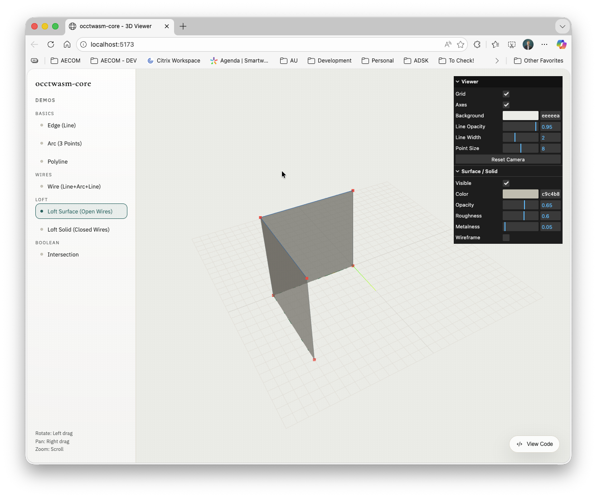

# occtwasm-core

OpenCascade (OCCT 8.0.0) compiled to WebAssembly with TypeScript bindings.

## Architecture

```
C++ OCCT Libraries (.a)
        |
  [embind C++ layer]        <- disambiguated names (e.g. Mirror_Pnt, Mirror_Ax1)
  (generated/ + manual/)      generated from YAML configs + parsed headers
        |
    WASM Module (.wasm + .js glue)
        |
  [TypeScript wrapper layer] <- proper overloads with instanceof dispatch
  (generated/ + manual/)      generated TS wrappers + module loader / types
        |
    NPM Package (@cesarecaoduro/occtwasm-core)
```

**Why two layers?** Emscripten's embind only supports overloading by argument count, while OCCT heavily overloads by type (e.g. `gp_Trsf::SetMirror(gp_Pnt)` vs `SetMirror(gp_Ax1)` vs `SetMirror(gp_Ax2)`). The C++ layer disambiguates with suffixed names; the TypeScript layer restores the original API with runtime `instanceof` dispatch.

**Why manual helpers?** Three codegen limitations require hand-written C++ embind wrappers:
1. Handle types (e.g. `GC_MakeArcOfCircle` returns `Handle(Geom_TrimmedCurve)`)
2. Virtual methods (`Shape()`, `Build()`, `IsDone()` are virtual and skipped by the parser)
3. Abstract base classes (e.g. `GCPnts_AbscissaPoint` takes `Adaptor3d_Curve&`)

## Quick Start

```ts
import { initOCCT } from '@cesarecaoduro/occtwasm-core';
import { gp_Pnt } from '@cesarecaoduro/occtwasm-core/TKMath';
import { BRepBuilderAPI_MakeEdge, BRepBuilderAPI_MakeWire } from '@cesarecaoduro/occtwasm-core/TKTopAlgo';
import { edgeLength, makeArcEdge3d, wireLength } from '@cesarecaoduro/occtwasm-core/helpers';

await initOCCT();

const p1 = new gp_Pnt(0, 0, 0);
const p2 = new gp_Pnt(10, 0, 0);
const maker = new BRepBuilderAPI_MakeEdge(p1, p2);
const edge = maker.Edge();
console.log(edgeLength(edge)); // 10.0

const a1 = new gp_Pnt(10, 0, 0);
const a2 = new gp_Pnt(0, 10, 0);
const a3 = new gp_Pnt(-10, 0, 0);
const arc = makeArcEdge3d(a1, a2, a3);
console.log(edgeLength(arc)); // ~31.42 (pi * 10)

const wire = new BRepBuilderAPI_MakeWire(edge, arc);
console.log(wireLength(wire.Wire())); // ~41.42
```

## Live Viewer

A Three.js-powered 3D viewer demonstrates the library interactively using Vite and lil-gui. It renders points and wires directly from OCCT shapes and also triangulates surfaces/solids for shaded previews.

**Demos included:**
- Edge (line)
- Arc (3-point)
- Polyline
- Wire (line + arc + line)
- Loft Surface (open wires)
- Loft Solid (closed wires)
- Wire Intersection (real intersection points)





```bash
cd examples/viewer
pnpm install
pnpm run dev
```

Use the sidebar to switch demos. Orbit: left drag. Pan: right drag. Zoom: scroll.

## Module Initialization

All generated bindings resolve the active Emscripten module from `initOCCT()`. Call `initOCCT()` once before using any bindings:

```ts
import { initOCCT } from '@cesarecaoduro/occtwasm-core';
await initOCCT();
```

If you host the WASM on a CDN, pass `locateFile`:

```ts
await initOCCT({
  locateFile: (path) => `https://cdn.example.com/wasm/${path}`,
});
```

## Memory Management

Embind objects are manual-lifetime. Call `.delete()` on objects you create:

```ts
const p = new gp_Pnt(1, 2, 3);
// ...
p.delete();
```

## Building from Source

### Prerequisites

- Emscripten (e.g. `brew install emscripten`)
- Node.js >= 18
- CMake

### Build Steps

```bash
npm install          # Install TS dependencies
make init-submodule  # Initialize OCCT git submodule
make build-occt      # Build OCCT static libs (Emscripten)
make codegen         # Generate embind C++ and TS wrappers
make build-bindings  # Compile WASM module (occt.js + occt.wasm)
npm run build        # Build TypeScript package
npm test             # Run tests
```

If you only change TypeScript wrappers or viewer code, `npm run build` is enough. If you add or modify C++ bindings, you must run `make build-bindings` first.

## Project Structure

```
extern/occt/                     # OCCT source (git submodule, V8_0_0_rc3)
scripts/                         # Build scripts (local Emscripten)
codegen/
  config/                        # Per-toolkit YAML configs
    modules.yaml                 #   Module registry (which toolkits to build)
    TKMath.yaml                  #   gp_* geometry classes (3D + 2D)
    TKBRep.yaml                  #   TopoDS/BRep topology classes
    TKTopAlgo.yaml               #   BRepBuilderAPI_Make* builder classes
    TKGeomBase.yaml              #   gce_Make* geometry construction classes
  src/                           # Codegen tool source
    codegen.ts                   #   Entry point
    parse-headers.ts             #   OCCT .hxx header parser
    parse-config.ts              #   YAML config loader + resolved types
    merge-config.ts              #   Merge YAML config with parsed headers
    emit-embind.ts               #   Generate C++ embind bindings
    emit-typescript.ts           #   Generate TypeScript wrappers
    type-mapper.ts               #   C++ <-> TS/embind type mapping
    overload-resolver.ts         #   Runtime overload dispatch codegen
    generate-yaml.ts             #   CLI tool to scaffold new YAML configs
bindings/
  generated/                     # Auto-generated by `make codegen`
    cpp/                         #   embind C++ (one file per OCCT toolkit)
      TKMath.cpp
      TKBRep.cpp
      TKTopAlgo.cpp
      TKGeomBase.cpp
    ts/                          #   TypeScript wrappers with runtime overload dispatch
      TKMath.ts
      TKBRep.ts
      TKTopAlgo.ts
      TKGeomBase.ts
  manual/                        # Hand-written code
    cpp/
      occt_wasm_init.cpp         #   Module-level init
      cast_helpers.cpp           #   TopoDS downcasting helpers
      arc_helpers.cpp            #   Arc edge from 3 points (wraps Handle types)
      curve_measure_helpers.cpp  #   Edge/wire length, point at length
      gprop_helpers.cpp          #   GProp_GProps + BRepGProp properties
      boolean_helpers.cpp        #   BRepAlgoAPI_Section (wire intersection)
      loft_helpers.cpp           #   BRepOffsetAPI_ThruSections (lofting)
      mesh_helpers.cpp           #   Triangulation for rendering (MeshShape)
    ts/
      types.ts                   #   OcctModule interface, InitOptions
      module-loader.ts           #   Async initOCCT() singleton WASM loader
      helpers.ts                 #   TS wrappers for manual C++ helpers
examples/
  viewer/                        # Vite + Three.js demo viewer
build/                           # Build artefacts (gitignored)
  occt-install/                  #   Pre-built OCCT static libraries + headers
  dist/                          #   occt.js + occt.wasm output
```

## Manual C++ Helpers

- Arc creation: `MakeArcEdge3d`, `MakeArcEdge2d`
- Curve measurement: `EdgeLength`, `WireLength`, `PointAtLengthOnEdge`, `PointAtLengthOnWire`
- Global properties: `BRepGProp_*` + `GProp_GProps`
- Boolean operations: `BRepAlgoAPI_Section`
- Lofting: `BRepOffsetAPI_ThruSections`
- Cast helpers: `TopoDS_ToVertex`, `TopoDS_ToEdge`, `TopoDS_ToWire`, etc.
- Meshing: `MeshShape` (triangulation for rendering)

## OCCT Libraries Linked

```
TKOffset > TKBO > TKBool > TKShHealing > TKTopAlgo > TKGeomAlgo > TKMesh >
TKBRep > TKGeomBase > TKG3d > TKG2d > TKMath > TKernel
```

## CI / Publishing

The package is published to the GitHub Packages npm registry via a manual-dispatch GitHub Action.

To install from GitHub Packages:

```bash
npm install @cesarecaoduro/occtwasm-core --registry=https://npm.pkg.github.com
```

Add to `.npmrc` if needed:

```
@cesarecaoduro:registry=https://npm.pkg.github.com
```

## License

LGPL-2.1-only WITH OCCT-exception-1.0 (same as OCCT).

This project does not claim additional rights over Open CASCADE Technology;
copyright and related rights for OCCT remain with Open CASCADE and its contributors.

Complete corresponding source and build scripts for the distributed WASM
artifacts are documented in `SOURCE_AVAILABILITY.md`.
